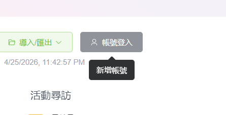
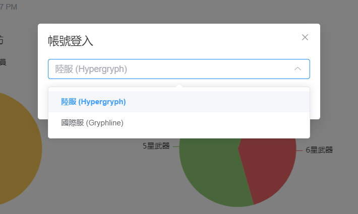
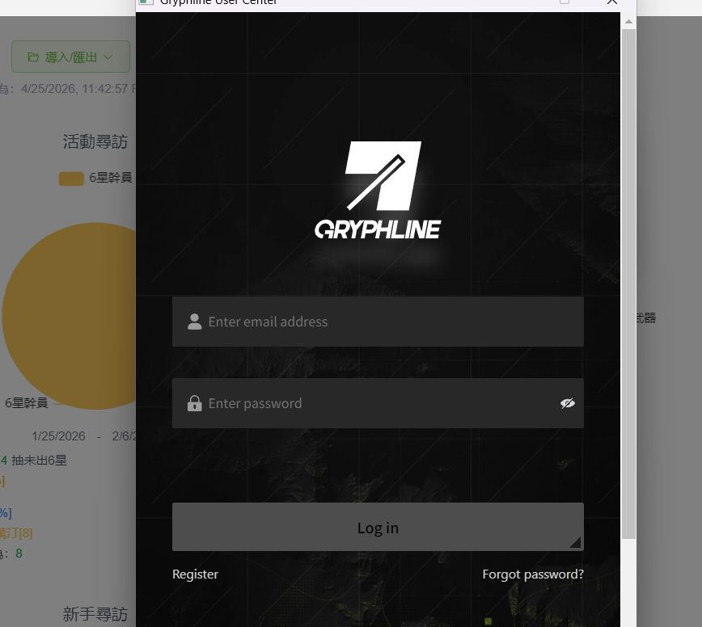
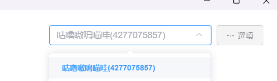
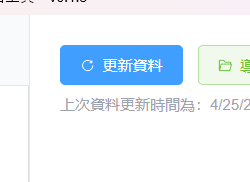

[English](docs/README_EN.md) | 繁體中文

<div align="center">
  <h1>Endfield Permit Export</h1>

  <p>
    一個《明日方舟：終末地》的抽卡記錄分析工具
  </p>

  <p>
    <a href="https://github.com/AiverAiva/Endfield-Permit-Export/releases">
      
    </a>
    
    <a href="https://github.com/AiverAiva/Endfield-Permit-Export/releases">
      
    </a>
    
  </p>
</div>

> **注意**：本工具由 [star-rail-warp-export](https://github.com/biuuu/star-rail-warp-export/) 修改而來，功能部份已改為適用於《明日方舟：終末地》。許多文字內容尚未完全與終末地相容，歡迎提交 Pull Request 更新或修正。

一個使用 Electron 製作的小工具，需要在 Windows 64 位元作業系統上執行。

透過鷹角官方帳號（陸服 Hypergryph / 國際服 Gryphline）登入，讀取遊戲抽卡記錄。不需要另外開啟遊戲。

## 其他語言

修改 `src/i18n/` 目錄下的 JSON 檔案即可翻譯成對應語言。如果覺得現有翻譯不準確或有可以改進的地方，歡迎隨時修改並發送 Pull Request。

## 使用說明

1. 下載工具後解壓縮 — 下載位置: [GitHub Releases](https://github.com/AiverAiva/Endfield-Permit-Export/releases/latest)
2. 點擊「帳號登入」（提示：新增帳號）

   

3. 選擇伺服器：陸服 (Hypergryph) 或 國際服 (Gryphline)

   

4. 在彈出的登入視窗中登入帳號

   

5. 登入成功後，從右上角下拉選單選擇帳號

   

6. 點擊「更新資料」即可讀取抽卡記錄

   

如需加入其他帳號，再點一次「帳號登入」即可。切換帳號用右上角的下拉選單。

## Development

```
# 安裝依賴
yarn install

# 開發模式
yarn dev

# 建置可執行程式
yarn build
```

## License

[MIT](LICENSE)